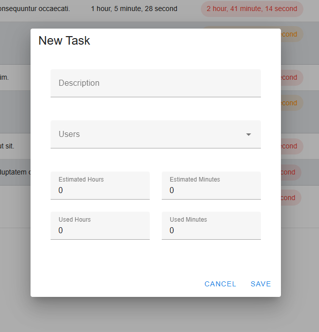

# Task Example WebApp


# Table of Contents

- [Overview](#overview)
- [Features](#features)
- [Minimum Requirements](#minimum-requirements)
- [Docker Services](#docker-services)
- [Installation With Docker](#installation-with-docker)
- [Installation Without Docker](#installation-without-docker)
- [Testing and Analysis Tools](#testing-and-analysis-tools)      
- [Running Tests](#running-tests)    
- [Docker Installation](#docker-installation)    
- [Docker Compose Installation](#docker-compose-installation)    
- [Example Images](#example-images)    

## Overview

This is a task management application built with Laravel 10 for the backend and Vue 3 for the frontend, featuring Pinia for state management and Vuetify for UI components.

## Features

- Task Creation and Modification: Users can create new tasks and modify existing ones.
- Task Filtering and Sorting: Tasks can be filtered and sorted based on various criteria.
- Time Tracking:
  - Each task includes two time fields:
    - Task Estimation Time: The estimated time to complete the task.
    - Task Used Time: The time spent working on the task.
  - Used Time: Users can add used time to existing tasks, and the time is added to the current Used Time field.
- Task Completion: Tasks can be marked as "completed" and reverted back to "in progress" if needed.

## Minimum Requirements

- **Docker and Docker Compose**
- **PHP**: 8.1 or higher
- **Composer**: 2.0 or higher
- **MySQL**: 5.7 or higher
- **Laravel**: 10.x
- **Node.js 20** or higher

## Docker Services

This project uses Docker to containerize the different components of the application. Below is a description of each service defined in the `docker-compose.yml` file:

- **nginx**: The Nginx service serves as a reverse proxy for the application, routing HTTP requests to the appropriate backend services.

- **php**: This service runs the PHP application (Laravel) using PHP 8.1. It is the core backend service that handles HTTP requests, interacts with the database, and manages the application logic. The service shares the application codebase with the host machine to enable hot-reloading during development.

- **mysql**: This service runs the MySQL database server, which stores the application's data. The database is configured with persistent storage to retain data across container restarts. The database credentials and other environment variables are defined in the `.env` file.

- **phpmyadmin**: A web-based interface for managing MySQL databases. It allows developers to interact with the database, run queries, and manage tables via a user-friendly UI. The service is accessible via a browser on port 80 (or a custom port defined in the `.env` file).

- **node**: This service is responsible for building and serving the Vue.js frontend application. It runs the Node.js server, compiles assets, and serves the frontend during development.
- 
- **selenium**: This service runs Selenium with a Chrome browser in a container to allow automated browser testing. It listens on port 4444 and is used for running Dusk tests.


## Installation With Docker

First, need a fresh installation of Docker and Docker Compose

### 1. Clone the Project

Clone the repository to your local machine:

```bash
git clone https://github.com/ubul86/task_webapp.git
cd task_webapp
```
 
### 2. Copy Environment File

Copy the .env.example file to .env

```bash
cp .env.example .env
```

Copy the .env.testing.example file to .env.testing
```bash
cp .env.testing.example .env.testing
```

### 3. Set Environment Variables
In the .env file, you need to set the DB connections and some Host.
Here is an example configuration:

```env
DB_CONNECTION=mysql
DB_HOST=mysql82
DB_PORT=3306
DB_DATABASE=your_database_name
DB_USERNAME=your_database_username
DB_PASSWORD=your_database_password
DB_ROOT_PASSWORD=your_database_root_password

NGINX_PORT=8080
PHPMYADMIN_PORT=45678
VITE_API_URL=/api/

```

The DB_HOST needs to be mysql82 service name.

### 4. Build The Containers

Go to the project root directory, where is the docker-compose.yml file and add the following command:

```bash
docker-compose up -d --build
```

### 5. Install Dependencies:

Install PHP dependencies using Composer:

```bash
docker exec -it {php_fpm_container_name} composer install
```

or
```bash
docker exec -it {php_fpm_container_name} bash
composer install
```

### 6. Generate Application Key

```bash
docker exec -it {php_fpm_container_name} php artisan key:generate
```

or
```bash
docker exec -it {php_fpm_container_name} bash
php artisan key:generate
```


### 7. Run Migrations

Run the database migrations with seed:

```bash
docker exec -it {php_fpm_container_name} php artisan migrate:fresh --seed
```

or

```bash
docker exec -it {php_fpm_container_name} bash
php artisan migrate:fresh --seed
```

### 8. Install Npm Packages


```bash
docker exec -it {node_container_name} npm install
```

or

```bash
docker exec -it {node_container_name} npm install
```

### 9. Build or Watch the frontend

```bash
docker exec -it {node_container_name} npm run build
```

or

```bash
docker exec -it {node_container_name} npm run watch
```

### 10. Change User and Group in php container

It is necessary to change the user and group inside the PHP container. This is currently an issue using the application with Docker, unfortunately.

```bash
docker exec -it {php_container} chown -R www-data:www-data *
```

## Installation Without Docker

### 1. Clone the Project

Clone the repository to your local machine:

```bash
git clone https://github.com/yourusername/your-repository.git
cd your-repository
```

### 2. Install Dependencies

Install PHP dependencies using Composer:

```bash
composer install
```

### 3. Copy Environments File

Copy the .env.example file to .env

```bash
cp .env.example .env
```

Copy the .env.testing.example file to .env.testing

```bash
cp .env.testing.example .env.testing
```

### 5. Configure the Database

Create a new database for the project and set the database connection in the .env file. Update the following lines in your .env file. There is an example setting:

```env
DB_CONNECTION=mysql
DB_HOST=127.0.0.1
DB_PORT=3306
DB_DATABASE=your_database_name
DB_USERNAME=your_database_username
DB_PASSWORD=your_database_password
```

### 6. Run Migrations

Run the database migrations:

```bash
php artisan migrate
```

### 7. Seed the Database

Seed the database with initial data:

```bash
php artisan db:seed
```

### 8. Start the Development Server

Run the Laravel development server:

```bash
php artisan serve
```

The application should now be accessible at http://localhost:8000.

### 9. Install Npm Packages

```bash
npm install
```

### 10. Build or Watch the Frontend With Vite

```bash
npm run build
```

or

```bash
npm run watch
```

## Testing and Analysis Tools

### PHP CodeSniffer (PHPCS)

PHPCS is used to check coding standards and style violations.

```bash
composer lint
```

or

```bash
docker exec -it {php_fpm_container} composer lint
```

### PHPStan

PHPStan is used for static code analysis to find bugs and improve code quality.

Run PHPStan:

```bash
composer analyse
```

or 

```bash
docker exec -it {php_fpm_container} composer analyse
```

Note: You might need to update your phpstan.neon configuration if you encounter issues or deprecations.

## Running Tests

### PHPUnit

Unit tests are written using PHPUnit. To run tests, first configure SQLite in-memory database in phpunit.xml or .env.testing file. This setup allows you to run tests without affecting your actual database. The database is created and discarded during each test run, ensuring a clean state.

- Open phpunit.xml and set up the SQLite in-memory database configuration:
```xml
<phpunit bootstrap="vendor/autoload.php" colors="true">
    <php>
        <env name="DB_CONNECTION" value="sqlite"/>
        <env name="DB_DATABASE" value=":memory:"/>
    </php>
</phpunit>
```

- Run the tests:
```bash
php artisan test
```

or

```bash
docker exec -it {php_fpm_container} php artisan test
```

This will execute all tests in the tests directory and provide a summary of test results.

### Dusk Testing

In addition to unit testing with PHPUnit, this project supports end-to-end testing using Laravel Dusk. To run Dusk tests, the following steps are required:

#### 1. Install the necessary dependencies: Ensure that the necessary environment variables are configured in the .env.sample or .env file.

Add the following lines to the .env.sample file:

```env
DUSK_DRIVER=chrome
DUSK_DRIVER_URL=http://selenium:4444/wd/hub
APP_URL=http://nginx  # Set the correct URL for your app when using Docker
```

#### 2. Set up Selenium: Ensure that the selenium service is included in your docker-compose.yml file (as shown above).

#### 3. Install Chromium: If you're running Dusk tests inside a Docker container, ensure that Chromium is installed and accessible. This can be added to the Dockerfile for the PHP service or a separate service if necessary.

#### 4. Run the Dusk tests: Once the environment is configured, run the Dusk tests with the following command:

```bash
docker-compose exec php php artisan dusk
```

This will execute all the Dusk tests in the tests/Browser directory. The tests will run using Selenium with the Chrome browser.

By following these updated instructions, you can now run both PHPUnit unit tests and Laravel Dusk browser tests within the Dockerized environment.


## Docker Installation

### Linux

- Ubuntu: https://www.digitalocean.com/community/tutorials/how-to-install-and-use-docker-on-ubuntu-20-04
- For Linux Mint: https://computingforgeeks.com/install-docker-and-docker-compose-on-linux-mint-19/

### Windows

- https://docs.docker.com/desktop/windows/install/

## Docker Compose Installation

### Linux

https://www.digitalocean.com/community/tutorials/how-to-install-and-use-docker-compose-on-ubuntu-20-04

### Windows
- Docker automatically installs Docker Compose.

## Example Images





